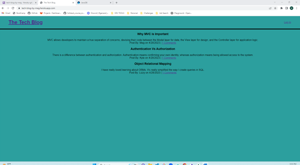

# Tech Blog Challenge

## Description

This application is a "tech blog" containing blog posts and comments about the blog. When a user visits the site, they can either "sign in" if they are an exisiting user or "sign up" if they are a new user. From there they can view all blog posts and comment on them. They can also add their own post.

## Table of Contents

- [Installation](#installation)
- [License](#license)
- [Usage](#usage)
- [ScreenShots](#screenshots)
- [Video](#video)
- [Links to Deployment](#linkstodeployment)
- [Credits](#LinkstoDeployment)
- [Contribution](#contribution)
- [Tests](#tests)
- [Questions](#questions)

## Installation

1. Clone the repo
2. npm install
3. npm start

## License

MIT

## Usage

Visit heroku site:

https://tech-blog-by-meg.herokuapp.com/

## ScreenShots

## Video

n/a

## Links to Deployment

https://tech-blog-by-meg.herokuapp.com/

## Credits

Ask BCS

Tutoring with Mazin and John

Lesson 14 mini project

Office hours

https://github.com/jdtdesigns/basic_mvc_auth_example

https://sequelize.org/docs/v7/other-topics/other-data-types/

https://www.youtube.com/watch?v=hKYjSgyCd60

https://handlebarsjs.com/guide/partials.html

https://github.com/jdtdesigns/basic_mvc_auth_example

https://github.com/jdtdesigns/starwars_project2_example/tree/starwars-auth-example

## Contribution

Megan Mathis

## Tests

n/a

## Questions

Any questions, please contact me at:

- GitHub:
  [MegMathis](http://github.com/MegMathis)
- Email:
  [mcdonough.megan25@gmail.com](mailto:mcdonough.megan25@gmail.com)
